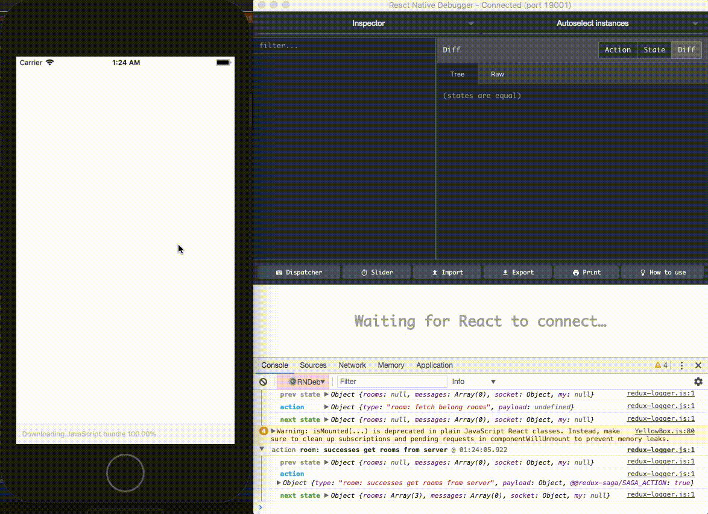

# react-native-websock-sample



## environment

- react-native (expo) generate by create-react-native-app
  - react-native-gifted-chat
  - react-navigation
  - native-base
- reudx
  - hard-reducer *type safe reducer with flow*
  - redux-saga *alternative side effect model for Redux*
  - react-redux
- socket.io
- flow


## Start development

### client

```bash
$ yarn install
$ yarn run start:server # enable live reloading by react-native-scripts
```

- with react-native-debugger

```bash
$ brew cask install react-native-debugger
$ open "rndebugger://set-debugger-loc?host=localhost&port=19001"
```

### server

```bash
$ cd server && yarn install && cd ..
$ yarn run start:server # enable live reloading by pm2
```


